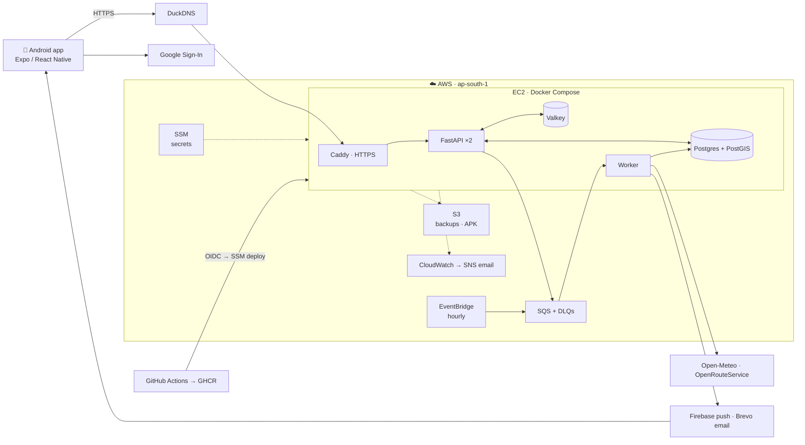

<div align="center">

# Lung Score: Lung Exposure Tracker

**How much polluted air did your lungs take in today, and what would help most?**

[](https://github.com/Akash4467/Lung-Exposure-Tracker/actions/workflows/ci-cd.yml)
[](https://github.com/Akash4467/Lung-Exposure-Tracker/actions/workflows/uptime.yml)
[](https://github.com/Akash4467/Lung-Exposure-Tracker/releases/latest)
[](LICENSE)

</div>

---

## About

Air-quality apps show the AQI at a station. They don't tell you what **you** breathed in. Lung Score estimates your own daily PM2.5 dose: the air where you actually spent your time, adjusted for how hard you were breathing.

It combines four things:

- **Where you are.** Home, work and commute, from your schedule and geofence visits.
- **The air there.** Hourly PM2.5 for each ~10 km area, from Open-Meteo, with nowcasting.
- **Indoors vs outdoors.** An indoor model covers windows, purifiers, cooking and smoke.
- **How much you breathe.** A personal breathing rate from age, sex, weight and activity.

The result is a daily **Lung Load** score with an uncertainty range and a "cigarettes equivalent". It also shows where the dose came from (home, work, commute) and what change would help most.

> ⚠️ **Estimated exposure, for information only. Not medical advice.**

### Features

| | |
| --- | --- |
| 🫁 **Today** | Lung Load ring, likely range, breathing rate, the live AQI outside, and where the dose came from |
| 🌤️ **Tomorrow** | Forecast Lung Load and the best hours to be outside |
| 🧪 **What-if** | Try a different commute time, a purifier or a mask, and see the change |
| 🗺️ **Map** | Air around you and your commute footprint on the map |
| 📈 **Trends** | Your Lung Load over days and weeks |
| 🔔 **Alerts** | Push notification when the air near your places gets bad |
| 🔐 **Accounts** | Email + password (verified by email code) or Google sign-in |

---

## 📱 Download the Android app

<table>
<tr>
<td width="200" align="center">
<br>
<sub>Scan with an Android phone</sub>
</td>
<td>

**[⬇️ Download lung-score.apk](https://lung-scorer.duckdns.org/app)**

1. Scan the QR code, or open the link on your phone. The APK downloads straight away.
2. Open it and tap **Install**. If Android asks, allow installs from your browser.
3. Sign up with email or Google.

- **Latest release:** [`v0.1.0`](https://github.com/Akash4467/Lung-Exposure-Tracker/releases/latest), also on GitHub Releases
- **Hosting:** the link always points at the newest build, served from AWS S3 (Mumbai) for a fast download
- **Server:** the app talks to `https://lung-scorer.duckdns.org` (live)

</td>
</tr>
</table>

---

## 🏗️ Architecture



- **Request path.** The app calls `lung-scorer.duckdns.org`. **Caddy** handles HTTPS (Let's Encrypt) and forwards to two **FastAPI** replicas. They read and write **Postgres + PostGIS** and use **Valkey** as a cache.
- **Background work.** Every hour, **EventBridge** puts a tick on **SQS**. The **worker** fetches air data, recomputes scores and sends push alerts. Jobs that fail repeatedly land in dead-letter queues.
- **Operations.**
  - Secrets live in **SSM Parameter Store**.
  - Logs, metrics and alarms are in **CloudWatch**, and alarms are emailed through **SNS**.
  - The database is backed up nightly to **S3**.
  - Only ports 80 and 443 are open, with no SSH.
- **Delivery.**
  - Every push to `main` runs the tests and builds ARM images to **GHCR**.
  - It then deploys through **GitHub OIDC** and **SSM Run Command**, with no stored AWS keys.
  - If a release fails its health checks, the deploy rolls back automatically.

More detail: [docs/architecture.md](docs/architecture.md) · [docs/deployment.md](docs/deployment.md)

### Tech stack

| Area | Tools |
| --- | --- |
| Mobile | Expo 57, React Native, Expo Router, TanStack Query, TypeScript |
| Backend | Python 3, FastAPI, SQLAlchemy (async), Alembic, uv |
| Data | PostgreSQL + PostGIS, Valkey, Amazon SQS |
| External APIs | Open-Meteo (air quality), OpenRouteService (routes), Firebase Cloud Messaging, Brevo, Google OAuth |
| Infrastructure | AWS (EC2 Graviton, EBS, S3, SQS, EventBridge, SSM, IAM, CloudWatch, SNS), OpenTofu, Docker Compose, Caddy, DuckDNS |
| CI/CD | GitHub Actions, GHCR, OIDC, ruff, mypy, pytest, `tofu test`, Jest |

---

## 📂 Project structure

```
Lung-Exposure-Tracker/
├── apps/
│   ├── api/                 # Python package: FastAPI API and SQS worker (same image)
│   │   ├── src/lung/
│   │   │   ├── engine/      #   pure scoring maths + config.yaml (no I/O)
│   │   │   ├── api/         #   HTTP routes
│   │   │   ├── auth/        #   JWT, passwords, Google sign-in
│   │   │   ├── services/    #   ingest, scoring, alerts
│   │   │   ├── integrations/#   Open-Meteo, routes, FCM, Brevo
│   │   │   ├── repositories/#   database access
│   │   │   └── worker/      #   SQS consumer
│   │   ├── migrations/      #   Alembic
│   │   └── tests/           #   unit + integration
│   └── mobile/              # Expo / React Native app (README inside)
│       └── src/app/         #   screens: auth, onboarding, Today, Tomorrow, Map, Trends, Settings
├── infra/                   # OpenTofu
│   ├── bootstrap/           #   state bucket
│   ├── modules/             #   network, compute, queue, storage, downloads, iam, monitoring, edge, rds
│   └── envs/                #   demo (live) · scale (ALB + RDS, switched off)
├── deploy/                  # Caddy, production Compose, Postgres image, deploy/backup scripts
├── site/                    # landing page served at the domain root
├── docs/                    # progress, architecture, deployment, engine maths
├── .github/workflows/       # ci-cd.yml, uptime.yml
├── docker-compose.yml       # local stack
└── Makefile                 # dev commands
```

---

## 🚀 Run it locally

**Requirements:** Docker, [uv](https://docs.astral.sh/uv/), Node 22 (for the app).

```bash
cp apps/api/.env.example apps/api/.env
make up && make migrate      # Postgres+PostGIS, Valkey and SQS in Docker
make seed && make worker     # demo user + live Open-Meteo data → scores
make api                     # http://localhost:18000/docs
make check-all               # lint + types + unit + integration tests
```

Mobile app: see [apps/mobile/README.md](apps/mobile/README.md). Full guide: [docs/local-development.md](docs/local-development.md).

---

## 📊 Status

| Layer | Status |
| --- | --- |
| 1. Foundation: uv, Docker, local stack | ✅ |
| 2. Scoring engine: stations, routes, indoor model, geofence, personal breathing, nowcast, uncertainty | ✅ |
| 3. Data: schema, Open-Meteo and routes, services, SQS worker | ✅ |
| 4. Auth and API: email/password, Google, JWT with rotating refresh, Brevo, FCM, rate limits | ✅ |
| 5. Mobile app: sign-in, onboarding, Today, Tomorrow, What-if, Map, Trends, Settings | ✅ APK `v0.1.0` released |
| 6. Infra and CI/CD: OpenTofu, Caddy, GHCR, SSM deploy, backups, alarms | ✅ live on AWS |

Change log and decisions: [docs/PROGRESS.md](docs/PROGRESS.md)

---

## 📚 Documentation

| Doc | What's in it |
| --- | --- |
| [How the numbers work](docs/how-the-numbers-work.md) | Every number the app shows, and its formula |
| [Engine parameters](docs/engine-parameters.md) | Every constant and its scientific source |
| [Architecture](docs/architecture.md) | Production shape on AWS, and why |
| [Deployment runbook](docs/deployment.md) | AWS setup, deploys, backups, alarms, costs |
| [Local development](docs/local-development.md) | Running the API, worker and app locally |
| [Progress](docs/PROGRESS.md) | What's done, what's next |

---

## License

[MIT](LICENSE) © 2026 Akash Bisht

<sub>Air data: [Open-Meteo](https://open-meteo.com) (CC BY 4.0). Lung Score estimates exposure and is not a medical device.</sub>
